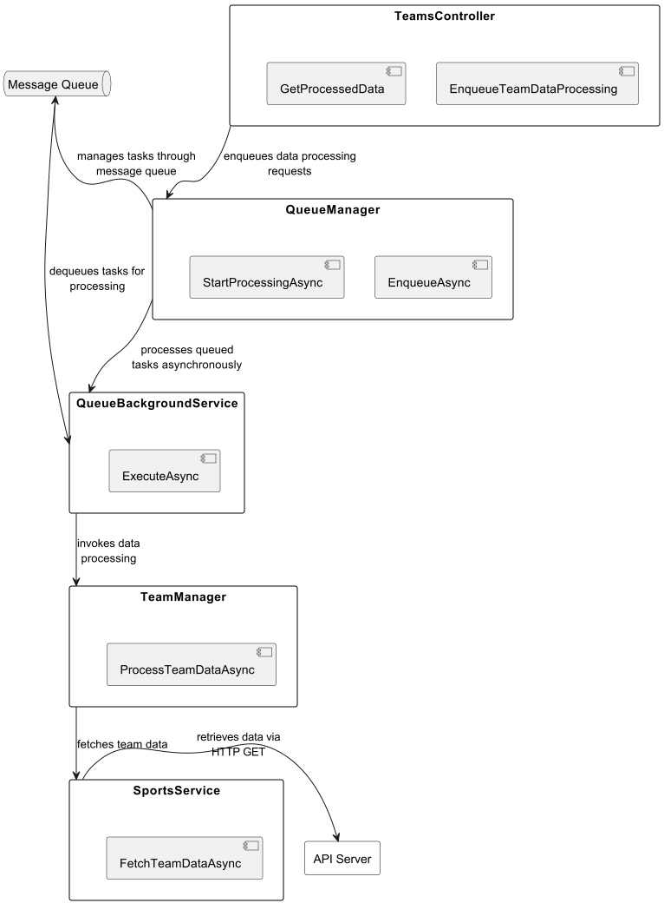

# SaturnService Project Documentation

## Overview

SaturnService is a web communication solution designed to fetch and process NFL team statistics from the 2020 season. This service utilizes a REST API to retrieve JSON formatted data for each team, enabling detailed analysis and presentation of team performances. A key feature of SaturnService is the integration of a message queue system, specifically Microsoft Message Queuing (MSMQ), to regulate requests to the server and implement remote procedure call (RPC) patterns for asynchronous data processing.

## Features

- **API Communication**: SaturnService communicates with an external API to fetch NFL team statistics, offering insights into each team's performance throughout the 2020 season.
  
- **Message Queue Implementation**: Utilizes MSMQ to manage and regulate requests, ensuring efficient processing and retrieval of data. This setup helps in maintaining the service's responsiveness and scalability.

- **Season Data Analysis**: Processes data for all NFL teams (1-32) from the 2020 season, including team names, team numbers, and season records based on game scores.

- **Flexible and Robust Design**: Designed with object-oriented principles, ensuring the system is robust against unexpected inputs and flexible for future expansions or modifications.

## Functional Requirements

1. **Server Communication**: Capable of interacting with external servers to fetch required data.
2. **JSON Data Presentation**: Supports presenting JSON data in a user-friendly format, either to the console or a file, including team names, numbers, and season records.
3. **Data Storage**: Efficiently stores the JSON response data for further processing or analysis.

## Non-Functional Requirements

1. **Implementation Language**: Developed in C#, leveraging the strengths of object-oriented programming (OOP) for a clean and maintainable codebase.
2. **System Robustness**: Designed to handle unexpected inputs gracefully, ensuring the system's reliability.
3. **Clean and Flexible Design**: Utilizes object-oriented design (OOD) principles to achieve a clean, maintainable, and flexible system architecture.
4. **Maintainability and Reusability**: Emphasizes modular and cohesive units for ease of maintenance and potential reusability in future projects.

## Client Repository

For the client application that interacts with SaturnService, please visit the following GitHub repository:

[SaturnClient Repository](https://github.com/ergutierz/SaturnClient.git)

## Design and Implementation

### Message Queue Model

The message queue, implemented using MSMQ, acts as a middleware layer that controls the flow of requests to the server. This setup not only helps in load balancing but also in decoupling the data fetching logic from the data processing components, allowing for asynchronous processing of team data. The queue listens for incoming tasks (team data fetch requests) and processes them sequentially, ensuring that each request is handled efficiently and without overwhelming the server.

### System Architecture

The system architecture is built around several key components:

- **SportsService**: Interfaces with the external API to fetch team statistics.
- **QueueManager**: Manages the message queue, ensuring tasks are enqueued and processed asynchronously.
- **TeamManager**: Processes fetched team data, analyzing and storing team performance statistics.
- **TeamRequest and TeamStat Models**: Define the data structure for requests and the format for processed statistics.
## Async Features

### API Communication
- **Asynchronous Requests**: Utilizes `HttpClient` to make asynchronous HTTP GET requests to fetch team data, preventing blocking of threads and enhancing responsiveness.
- **Async/Await Pattern**: Implements the async/await pattern in `FetchTeamDataAsync` to ensure non-blocking I/O operations, crucial for maintaining system responsiveness.

### Message Queue Implementation
- **Asynchronous Processing**: Leverages a `Channel<T>` in `QueueManager` to queue tasks and process them asynchronously, ensuring smooth handling of multiple requests.
- **Concurrent Processing**: Utilizes asynchronous methods to read from and write to the queue, enabling concurrent processing of team data requests without blocking the main execution flow.

### Data Processing and Caching
- **Asynchronous Data Parsing**: In `TeamManager`, JSON data parsing and processing are performed asynchronously, allowing the system to handle other tasks concurrently.
- **Efficient Caching**: Uses `IMemoryCache` to cache processed data asynchronously, ensuring quick retrieval of processed results without re-executing complex computations.

## Async Design Impact

- **Improved Scalability**: By processing requests and data asynchronously, SaturnService can handle a larger number of concurrent requests without significant delays or resource contention.
- **Enhanced Responsiveness**: Asynchronous operations prevent the service from becoming unresponsive, even under heavy load, by avoiding thread blocking during I/O operations.
- **Robust Error Handling**: Asynchronous methods in C# support exception handling, allowing SaturnService to manage and log errors effectively without disrupting the service's operation.

## Detailed Async Code Analysis

### `SportsService.FetchTeamDataAsync`
- Executes an HTTP GET request asynchronously.
- Uses `await` to asynchronously wait for the response without blocking the thread.
- Processes the HTTP response asynchronously to extract the team data.

### `TeamManager.ProcessTeamDataAsync`
- Fetches team data using an async method from `SportsService`.
- Parses and processes the JSON response asynchronously, optimizing CPU-bound tasks.
- Caches the processed data asynchronously, enhancing data retrieval efficiency in subsequent requests.

### `QueueManager<T>.StartProcessingAsync`
- Reads tasks from the channel asynchronously, ensuring non-blocking dequeue operations.
- Processes each task asynchronously, allowing multiple tasks to be processed in parallel.

### `QueueBackgroundService.ExecuteAsync`
- Runs an infinite loop that processes queued tasks asynchronously.
- Ensures that the service remains active and responsive, processing tasks as they arrive without blocking other operations.

The asynchronous design of SaturnService significantly enhances its efficiency and responsiveness. By leveraging the async/await pattern and asynchronous data handling mechanisms, the service can process a high volume of requests while maintaining a responsive and robust architecture. This approach is crucial for web-based services, where responsiveness and scalability are key to handling varying loads and ensuring user satisfaction.

### Class and System Models

The class model, detailed using UML diagrams, outlines the relationships and dependencies between the various components of SaturnService. Similarly, the system model illustrates the flow of data from the external API through the message queue to the final processing and presentation stages.
## UML Diagram

## System Model
